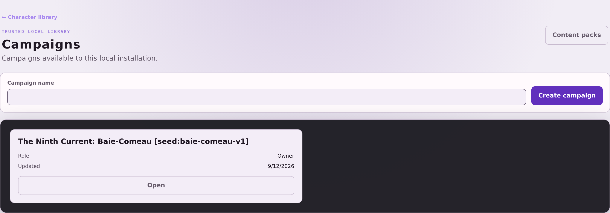
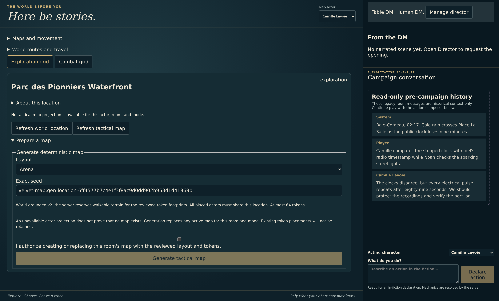
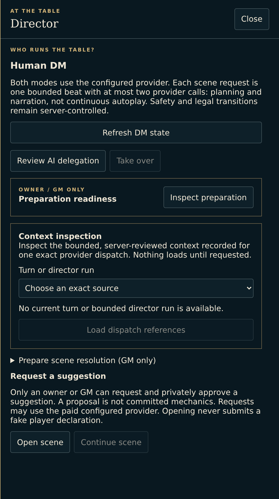
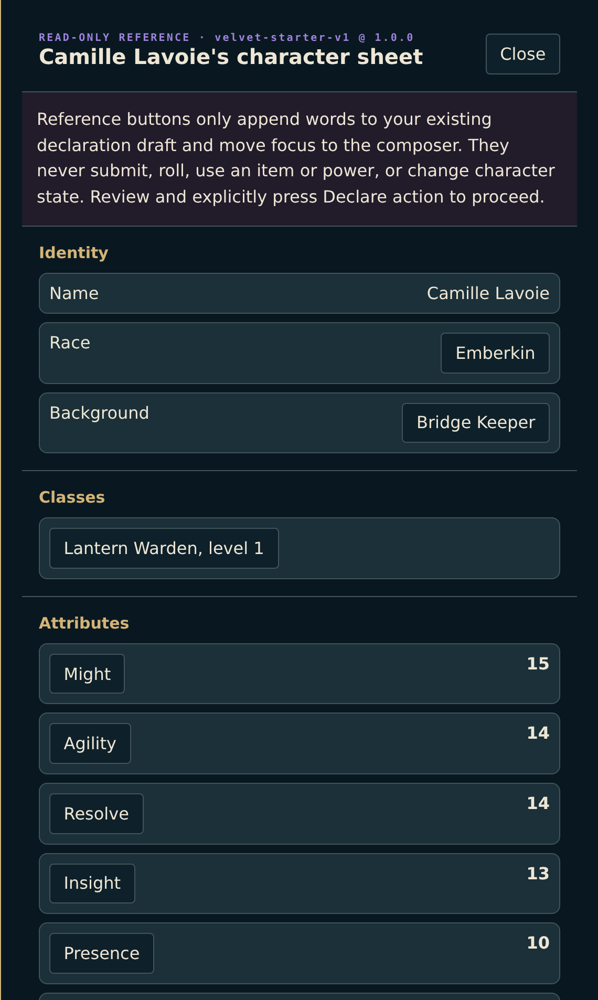
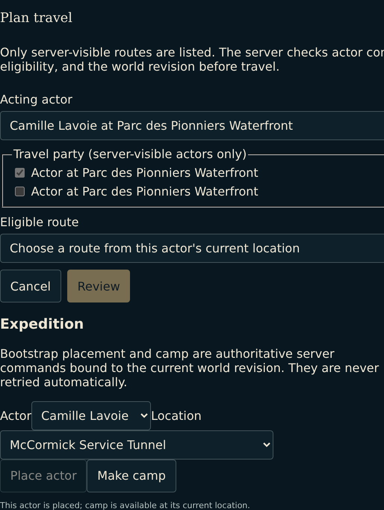
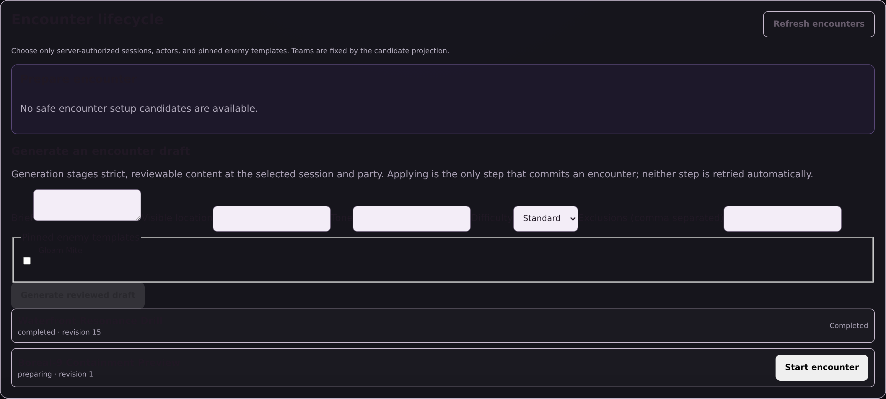
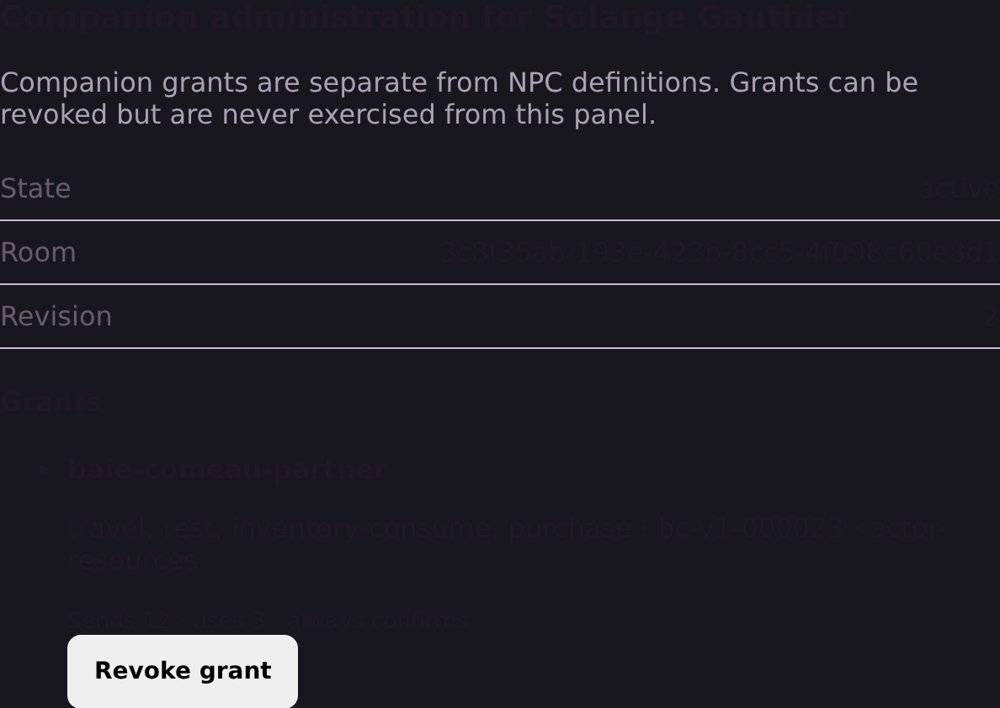

# VelvetRP

VelvetRP is a local-first AI roleplay and campaign RPG application built around one strong idea:

> The model can propose what happens next. It cannot decide what became true.

Velvet combines a character-driven roleplay experience with a persistent campaign engine. Players can write declarations to a shared campaign room, while the server owns the campaign timeline, characters, world state, quests, inventory, encounters, rules, and receipts. A React client talks to a loopback Fastify server, and the default deployment stores everything in local SQLite.

This is not a chatbot with RPG flavor text added on top. It is an attempt to make AI-assisted roleplay inspectable and mechanically trustworthy: provider output is untrusted input, game state is authoritative repository state, and narration is produced only after the relevant mutation has committed.

## Why Velvet Is Different

### AI is a bounded participant

The provider receives a role-filtered, size-bounded context basket and only the state-dependent tools selected by the server. It cannot choose its audience, invent a target, supply a destination, alter a revision, execute undeclared tools, or turn a failed command into fictional success. The server parses and revalidates every response before anything changes.

### Mechanics produce receipts, not suggestions

RPG mutations use server-derived candidates, expected revisions, idempotency keys, immediate SQLite transactions, immutable command/event/receipt records, and authoritative read reconciliation. If a request times out after committing, the safe action is to read the receipt, not blindly retry it. This applies to campaign actions, character progression, inventory, combat, rests, travel, rewards, and adventure-tool bridges.

### Campaign generation is reviewed materialization

AI-generated campaign content is staged as bounded candidates. A GM selects a dependency-closed set and explicitly applies it. Generated quests, locations, NPCs, story graphs, handouts, and scene prompts do not silently become canon, executable items, or monster stat blocks.

### Rules and content are swappable and pinned

Rules modules are pure deterministic code. Content is published as immutable, validated packs and campaigns bind to exact `(packId, packVersion)` identities. The current development SRD starter is `srd-5.1:starter@1.2.0+7f94bb928392`; changing content means publishing a new exact version rather than rewriting history.

### The world keeps a bounded memory

The campaign remembers through direct, query-derived SQLite recall rather than a vector database or a hidden summarizer. Deterministic candidate selection ranks source-attributed material under strict query, whole-hit, and byte caps; the AI Director may also inspect its own immutable dispatch provenance, and a missing or expired recall never becomes story truth. Separately, an immutable observation ledger records who witnessed, was told, or gossiped what, so present NPCs can speak from recorded knowledge instead of omniscient invention.

### The Director leads without owning the truth

An optional AI Director composes an ordered beat from one to three server-issued candidates, may advance recorded world time or present an ambient transition, and narrates present-NPC ledger knowledge with explicit attribution. Each candidate commits with its own receipt, a later failure records a partial-completion blocker instead of rolling back earlier receipts, and the Director can only select supported candidates. It never invents mechanics, chooses a player character's action, or turns earlier prose into canonical history.

### Local-first is an operational boundary

The default server binds to loopback and uses a fixed trusted-local principal. A provider is optional: without one, roleplay has a clearly marked deterministic local stub and RPG recovery remains deterministic. Local-first does not mean that configured provider traffic stays on-device, and Velvet is not currently a remote multi-user service.

## Screenshots

These views are captured from the seeded, provider-free Baie-Comeau campaign at 1920x1200 (2x) and use illustrative, fictional names and content.

**Campaign library** — prepare, attach rooms, and start a table from one place.



**Living Atlas table** — the authoritative map and conversation composer.



**Director** — human/AI delegation, Open and Continue scene, and private review.



**Character sheet** — server-owned checks, powers, effects, resources, and equipment.



**World expedition** — owner/GM bootstrap placement and camp.



**Combat tracker** — encounter lifecycle and reviewed generation.



**Cast and companion administration** — create a companion and author an exact grant.



## What Is Shipped

### Roleplay

- Character profiles with boundaries, memories, lore, summaries, relationships, and rich personality fields.
- One-to-one and group sessions with attributed messages, streaming, cancellation, branches, and reply swipes.
- A durable campaign-room DM transcript with role-filtered context, bounded provider tools, confirmations, receipt-grounded narration, and deterministic recovery.
- Provider settings, usage accounting, prompt/harness controls, and local deterministic fallback behavior.

### Campaign RPG

- Campaign lifecycle, memberships, rooms, timelines, checkpoints, recaps, import/export, and exact content-pack pinning.
- Character drafts, server-owned rolls, finalization, derived sheets, ancestry data, XP, progression, resources, inventory, equipment, economy, and rests.
- Server-resolved checks, powers, effects, legal combat actions, encounters, rewards, quests, world state, NPC presence, factions, reputation, and story graphs.
- Reviewed campaign generation and explicit publication of player-safe handouts and scene prompts.
- Authoritative tactical maps with role-safe projections, movement previews, line-of-effect, cover, ranged weapons, thrown weapons, and opportunity reactions.
- Browser-playable character actions: server-resolved checks, power and spell use, conditions and effects, resource tracks, rests, equipment, vendor sale, and bilateral trade accept/cancel, each bound to the current revision and reconciled from authoritative reads.
- Client workflows for owner/GM room detach, actor placement and camp, companion administration, and reviewed encounter drafts.
- A bounded SRD 5.1 development subset with seven starter ancestries, level progression, equipment, selected spells, Magic Missile, Healing Word, Rage resistance, Lay on Hands, and server-authoritative combat state.

### The AI Director, memory, and knowledge

- A persisted campaign-wide human/AI Director, separate from the player adventure agent, with explicit delegation and takeover, Open scene and Continue scene, a bounded private planning lane, and a separate public narrator.
- Ordered one-to-three-candidate beats where each candidate commits in its own transaction with a receipt; a later failure records a partial-completion blocker rather than rolling back earlier receipts.
- Bounded read-only grounding rounds, receipt-recorded world-time advancement, ambient transition beats that hand pacing back without requiring a narrative question, and prior-scene continuity that is explicitly labeled and never treated as evidence.
- Public narration that carries present-NPC ledger knowledge with explicit attribution, plus a provider-free Director candidate-choice oracle and rubric and a capped live playtest harness.
- Direct source-attributed SQLite recall with strict query, hit, and packet limits, immutable narration dispatch provenance, GM-only no-replay inspection, and provider-free readiness diagnostics.
- An immutable NPC observation ledger for witnessed, told, and gossiped knowledge with trust-gated reads and a provider-free attribution, privacy, negation, and disclosure evaluator.

The SRD module is deliberately partial. Guiding Bolt, most cantrips, broad spell saves and attack rolls, subclasses, feats, multiclassing, and many ancestry traits remain fail-closed or metadata-only. See the [SRD coverage matrix](docs/srd-5.1-coverage.md) for the exact boundary.

## Trust, Security, And Privacy

Local-first describes storage and deployment, not a guarantee that all processing stays on the device.

- SQLite data is local by default.
- When a remote model provider is configured, Velvet sends assembled prompts and conversation context to that provider. Review the provider's privacy and retention terms.
- Without a usable provider, roleplay uses a clearly marked deterministic local stub. RPG adventure turns use deterministic recovery after provider failure, including receipt-backed fallback narration and authoritative enemy-turn recovery; this is a delivered M4 recovery path, not a placeholder for future tool-loop work.
- The server defaults to `127.0.0.1` and RPG routes use the fixed `local-owner` principal. There is no authentication boundary. Authorization and principal headers are ignored.
- Do not expose this server to a LAN, the internet, a reverse proxy, or multiple untrusted users. `FEATURE_REMOTE_AUTHENTICATION` is discovery-only rollout state, not implemented authentication.
- Provider keys are persisted locally and are never returned by the public provider API. Authorization headers are sent only to allowlisted hosted providers or loopback hosts.

## Detailed Scope

The following inventory is intentionally more concrete than the product overview above. It describes shipped surfaces, not promises about the deferred roadmap.

### Roleplay

- Character create, edit, import, export, archetypes, boundaries, and rich goal/ideal/bond/flaw/history/personality/fears/relationships/appearance/voice profiles
- One-to-one and up-to-12-character sessions with attributed messages
- Model-routed room turns with bounded sequential speakers and auto-follow-up rounds
- Streaming, cancellation, branches, reply swipes, and durable solo conversations
- Approved and pending memories, scoped lore, summaries, and editable scene canon
- A 20-layer prompt studio, provider settings, usage accounting, and cost estimates

### Campaign RPG

- Campaign lifecycle, settings, memberships, rooms, timelines, checkpoints, recaps, import, and export
- Immutable content-pack validation/publication, exact campaign pins, and built-in starter choices
- Character drafts, finalization, derived sheets, XP, level advancement, resources, inventory, economy, and rest
- Full server-roll character-draft rerolls with immutable roll history and exact replay
- Server-resolved checks, powers, effects, encounters, legal combat actions, logs, and rewards
- Exact-once starter inventory/wallet materialization, GM actor placement, and recipient-safe combat reward claim/reconciliation
- World travel, NPCs, factions, reputation, quests, clues, story graphs, and role-filtered projections
- Authoritative room-scoped NPC place, move, and remove commands with role-safe running-cast and stopped-history projections
- Owner/GM companion administration through an authoritative management GET, a closed receipt-only create-companion/grant-create/grant-revoke command POST, and a Cast studio panel; delegated grant exercise, dismissal, proposal/decision administration, and public member HTTP projection remain undelivered
- Exact pinned consumable action GET, command POST, and exact-result GET settle the supported quantity-one damage, healing, and health/guard/focus subset atomically; the combat UI uses only the server target and action cost, persists ambiguity before POST, never retries automatically, and reconciles exact result plus combat/log/actions, while instant modifiers remain fail-closed
- Client studios for administration, content, characters, sheets, combat, world, cast, journals, history, and transfer
- Durable adventure turns, reconciliation, confirmations, mechanic receipts, narration swipes, and reviewed encounter and campaign-content drafts with authoritative application
- Reviewed sparse campaign generation/expansion with standard quest/story/world materialization, inert encounter planning, and explicit public handout/scene-prompt delivery
- Server-internal campaign context assembly with role-derived audience visibility, exact precedence, independent UTF-16 whole-line budgets, and session/speaker-persona binding
- A role-selected, bounded provider tool loop with deterministic command bridging, durable resume, and receipt-aware narration and recovery
- One authoritative durable DM conversation per campaign room, with a bounded transcript that collapses narration derivatives; legacy room messages remain read-only pre-campaign history
- A full gameplay sheet with authoritative action panels for checks, powers and spells, conditions and effects, resources, rests, equipment, vendor sale, and trade accept/cancel, plus the read-only `actor_sheet.read` projection used inside the provider loop; sheet references and the topological, not-to-scale route map only prefill declarations and never execute actions
- The persisted human/AI Director with delegation and takeover, Open and Continue scene, ordered candidate beats, bounded read-only grounding, receipt-recorded world time and ambient transition beats, knowledge-attributed narration, and partial-completion blockers
- Owner/GM room detach, actor placement and camp, and reviewed encounter generation/application, all reachable from the client
- Direct source-attributed SQLite recall with immutable narration dispatch provenance and GM-only no-replay context inspection; no FTS, vector store, automatic summary, or alias expansion is implemented
- An immutable NPC observation ledger for witnessed, told, and gossiped knowledge with trust-gated reads and a provider-free attribution, privacy, negation, and disclosure evaluator
- Foundation, Full narrative campaign, and Custom / granular reviewed generation over 11 supported narrative sections, with explicit artifact selection/apply and separate player-material publication

The registered `dnd-5e@1.0.0` rules module is a tested development subset adapted from the 2014 SRD 5.1, not full D&D support or full SRD conformance. It provides pure deterministic helpers for the mechanics listed in the [coverage matrix](docs/srd-5.1-coverage.md); many rules and feature interactions remain partial or unsupported. This work includes material from Wizards of the Coast LLC's [official SRD source page](https://www.dndbeyond.com/srd) and the exact [System Reference Document 5.1 CC PDF](https://media.dndbeyond.com/compendium-images/srd/5.1/SRD_CC_v5.1.pdf), licensed under [CC BY 4.0](https://creativecommons.org/licenses/by/4.0/legalcode). VelvetRP adapts and modifies that material into deterministic software mechanics; Wizards of the Coast LLC has not endorsed these modifications.

The full operation contract is in the [API reference](docs/api.md): 148 counted explicit trusted-local RPG operations plus feature discovery, excluding implicit HEAD aliases. The implementation intentionally does not duplicate the route and schema tree here.

## Requirements

- Node.js 22
- npm
- Playwright Chromium for browser E2E tests
- Optional OpenAI-compatible local or hosted provider

## Setup

```bash
npm install
cp .env.example .env
```

Edit `.env` as needed. For the complete RPG UI, enable the campaign, mechanics, combat, and studio flags. Leave remote authentication disabled because it is not an authentication implementation.

The application does not load `.env` automatically. Export it into each shell that starts Velvet:

```bash
set -a
source .env
set +a
npm run dev
```

Services:

| Service | Default URL |
| --- | --- |
| Client | `http://localhost:5173` |
| Server | `http://127.0.0.1:8787` |
| Health | `http://127.0.0.1:8787/api/health` |

The Vite development server proxies `/api` to `VELVET_API_URL`, defaulting to `http://localhost:8787`.

### Provider Configuration

The root `.env.example` is the complete user-facing server-runtime/client-development example and uses recommended OpenRouter overrides. `OPENAI_BASE_URL`, `OPENAI_MODEL`, and `OPENAI_API_KEY` are legacy-compatible fallbacks; `server/.env.example` is an intentionally narrower server/OpenAI sample. Environment values provide bootstrap defaults while no provider row exists; after settings are saved through the application, persisted settings take precedence. A defined OpenRouter value, including an empty string, suppresses its OpenAI fallback. Local OpenAI-compatible loopback providers can run without a key.

See [Provider configuration](docs/provider-configuration.md) for URL restrictions, supported settings, persistence, and transmission behavior.

### Feature Flags

Flags are enabled only by the exact string `true` and default to false.

| Flag | Effect or dependency |
| --- | --- |
| `FEATURE_VOICE` | Reports voice rollout availability |
| `FEATURE_IMAGES` | Reports image rollout availability |
| `FEATURE_RPG_CAMPAIGN` | Enables campaign administration and transfer routes |
| `FEATURE_RPG_MECHANICS` | With campaign, enables mechanics, content, world/story, play, adventure-turn, and generation routes |
| `FEATURE_RPG_COMBAT` | With campaign and mechanics, enables encounter and combat routes/UI |
| `FEATURE_RPG_STUDIO` | With campaign and mechanics, exposes narrative studio navigation in the client |
| `FEATURE_REMOTE_AUTHENTICATION` | Reports rollout state only; supplies no authentication |

These are rollout controls, not permissions or security controls.

## Commands

```bash
npm run dev             # contracts build, then server and client watchers
npm run dev:server      # contracts build, then Fastify watcher
npm run dev:client      # contracts build, then Vite
npm run typecheck       # contracts, server, client, and E2E projects
npm run build           # contracts, server, and client production builds
npm test                # contracts, server, and client unit/component tests
npm run test:e2e        # deterministic Playwright suite with disposable DB/provider
npm run test:e2e:live   # opt-in live-provider Playwright suite
npm run health          # final/release gate; prerequisites must already be installed
npm run ci              # clean install, typecheck, build, and unit tests
```

Install the browser once:

```bash
npx playwright install chromium
```

Run the built, production-like Fastify server after `npm run build`:

```bash
npm --workspace velvet-mvp-server start
```

The deterministic E2E command starts isolated test servers and does not make paid provider calls. Live E2E is separate, opt-in, operates on a temporary online backup of the configured database, and may incur provider cost:

```bash
VELVET_E2E_LIVE=1 npm run test:e2e:live
```

For a final or release gate, run `npm run health`: typecheck -> build -> `npm test` -> deterministic E2E, exactly once each and fail-fast. It excludes live-provider E2E and does not install dependencies or Chromium. Use the [canonical unique `/dev/shm` invocation](docs/operations.md#release-health-gate).

## Architecture

```text
React/Vite client
  -> HTTP and SSE through client/src/api.ts
Fastify server
  -> roleplay routes and generation services
  -> feature-gated /api/rpg/v1 routes
Shared @velvet/contracts Zod schemas
  -> request, response, persistence-boundary validation
Repository and deterministic command services
  -> SQLite current-schema initialization, transactions, revisions, events, and receipts
Provider adapter
  -> OpenAI-compatible /chat/completions or local stub
```

The npm workspace is organized as:

- `packages/contracts/`: shared runtime contracts and inferred TypeScript types
- `server/`: Fastify composition, roleplay/RPG routes, context and provider services, repositories, and the current SQLite schema
- `client/`: React application and typed API/SSE consumers
- `e2e/`: deterministic and opt-in live Playwright workflows
- `docs/`: API, architecture, roadmap, streaming, provider, and harness references

Contracts-first changes keep HTTP and repository boundaries strict. RPG mutations generally use expected revisions, idempotency keys, atomic transactions, immutable events/receipts, and authoritative reads after ambiguous delivery.

## Persistence

The default database is `server/data/velvet.sqlite` when the server is launched through its workspace. Set `VELVET_DATA_DIR` to use another directory. The server creates the directory with best-effort owner-only permissions and enables SQLite WAL mode, foreign keys, and a busy timeout.

A missing or empty database is initialized atomically from `server/src/repo/db/currentSchema.sql`, `server/src/repo/db/campaignDmSchema.sql`, and `server/src/repo/db/recallSchema.sql`; the server build copies all three assets. Development databases are disposable: schema changes require deleting and recreating `velvet.sqlite`, except for narrowly recognized exact tactical-map, campaign-director, and pre-recall predecessors. Supported upgrades add map-v2 storage, initialize pre-director campaigns in human mode, upgrade exact director review-authority/narration schemas, or add immutable adventure narration dispatch context as applicable. Missing recall storage is also installed within recognized older director/map upgrade transactions; it is not a search index or new story truth. The review-authority upgrade preserves historical rows but cancels planning/awaiting-approval runs; it does not replay paid work. Complete current-schema, SQLite quick/foreign-key, and required-reference checks must pass before commit; failure rolls back the upgrade. All other unknown, modified, or partially upgraded schemas are rejected without repairs, backfills, rewinds, or historical imports. See [Operations](docs/operations.md#data-directory-and-current-schema) for the exact supported shapes before changing stored data. Campaign export deliberately omits credentials, local paths, usage history, and private actor state.

## Limitations

- Campaign context excludes full catalogs, full inventories, story graph dumps, unrelated private state, hidden routes, and controller identities. NPC/enemy target-private planning is non-disclosable. Legacy character prompting accepts only exact session- and persona-bound player/NPC baskets; DM/enemy legacy prompts fail closed, while the composed adventure orchestrator selects role-authorized player or enemy context.
- Adventure tools are a closed, role- and state-selected vocabulary of exact candidates and bounded commands: context and state reads, attribute and dice, legal combat actions, travel, quest objective and lifecycle, SRD checks, inventory actions, present-vendor commerce, power use, rests, pinned combat consumables and powers, and progression. They do not provide arbitrary inventory or power use, area or multi-target targeting, resource initialization, encounter start, or arbitrary effects, and they fail closed when no supported candidate exists. Sheet/map references never auto-execute. Direct HTTP mechanics remain separate and only their documented closed commands are supported.
- Campaign generation supports outline, arcs, locations/connections, factions, NPCs, quests, encounter concepts, clues, story nodes/relationships, handouts, and scene prompts. It does not mechanically generate items, executable monsters/stat blocks, or campaign-native lore.
- The campaign-visible NPC roster is the set of available campaign NPCs; persisted room presence is separate explicit M5.1 state. The context drawer uses the roster for GM placement choices and the authoritative present-cast read for running presence or stopped history. Existing exclusions remain: unrelated roster entries are not treated as present, and hidden locations, controller identities, and role-private NPC state are not added to player projections.
- Published content-pack versions are immutable. Create a new exact version to change one.
- Append-only multiclass progression remains outside the current runtime.
- Discord, VTT adapters, and simultaneous encounters remain deferred.
- Feature flags can hide surfaces but cannot authorize users.

## Testing

For local development, run the owning workspace typecheck and only the test file(s) affected by the change, for example `npm run test --workspace velvet-mvp-server -- test/repo.test.ts`. Run `npm test` for broad or cross-workspace changes, or before merging when CI is unavailable. CI is the normal full validation gate and runs all unit tests plus deterministic E2E. Run `npm run test:e2e` locally when behavior crosses browser, API, streaming, or persistence boundaries. Run live E2E only when intentionally validating a configured provider. Test totals are intentionally omitted because they change frequently.

The deterministic browser suite uses disposable SQLite and an in-process fake provider, so it charges nothing. It exercises character-sheet actions, vendor sale, bilateral trade accept/cancel, expedition placement and camp, companion administration, reviewed encounter generation, tactical movement, session recovery, the Director lifecycle, campaign memory recall, and GM context inspection through the real client, HTTP layer, and persistence boundary.

## Policy Status

The current policy layer is limited, not a comprehensive content-moderation system. Character checks are permissive. User input receives control-character and simple prompt-injection marker sanitation, and assistant output checks a small boundary/refusal-bypass phrase list. Character boundaries and memory approval behavior still apply, but operators must not treat this stub as a complete safety policy.

## Documentation

| Document | Purpose |
| --- | --- |
| [Documentation index](docs/README.md) | Complete guide inventory and authority hierarchy |
| [Roadmap](docs/ROADMAP.md) | Current dependency-ordered milestones and deferred scope |
| [API reference](docs/api.md) | HTTP behavior, contracts, flags, and RPG operation inventory |
| [Operations](docs/operations.md) | Setup, environment, disposable development storage, and release gates |
| [Campaign generation](docs/campaign-generation.md) | Reviewed generation, selective application, planning, and material delivery |
| [DM harness architecture](docs/dm-harness-architecture.md) | Authoritative conversation, trust boundaries, sheet references, tools, limitations, ruleset scope, and agent best practices |
| [AI dungeon master](docs/ai-dungeon-master.md) | Director controls, bounded planning, narration, research, authority boundaries, and limitations |
| [Frontend control plane](docs/frontend-control-plane.md) | Living Atlas workspace, preparation, session recovery, and browser acceptance coverage |
| [Vendor commerce](docs/vendor-commerce.md) | Exact visible-vendor candidates, confirmation, authoritative prices, and replay |
| [Exact combat sheet actions](docs/combat-sheet-actions.md) | Exact combat consumable and power candidates, settlement, and exclusions |
| [Bounded campaign memory](docs/campaign-memory.md) | Direct SQLite recall, source and authority scope, packing limits, and migration behavior |
| [NPC knowledge and rumors](docs/npc-knowledge-rumors.md) | Observation ledger, rumors, attribution, privacy, and evaluation gates |
| [Gameplay agent instructions](docs/interactive-gameplay-agent-instructions.md) | Trusted-local API workflow and reconciliation guidance |
| [RPG integration plan](docs/rpg-integration-plan.md) | Product and mechanics integration design |
| [Roleplay architecture](docs/roleplay-architecture-2026.md) | Roleplay context and generation architecture, including historical notes |
| [Repository architecture](docs/repo-architecture.md) | Repository boundaries and transaction conventions |
| [Streaming](docs/streaming.md) | Roleplay SSE framing and cancellation |
| [Provider configuration](docs/provider-configuration.md) | Provider settings and live-test behavior |
| [Customizable harness](docs/customizable-harness.md) | Prompt layer and harness controls |
| [Development plan](devplan.md) | Compact completion ledger and next milestone |
| [Engineering handoff](handoff.md) | Current implementation handoff |
| [Contributing](CONTRIBUTING.md) | Development and validation expectations |
