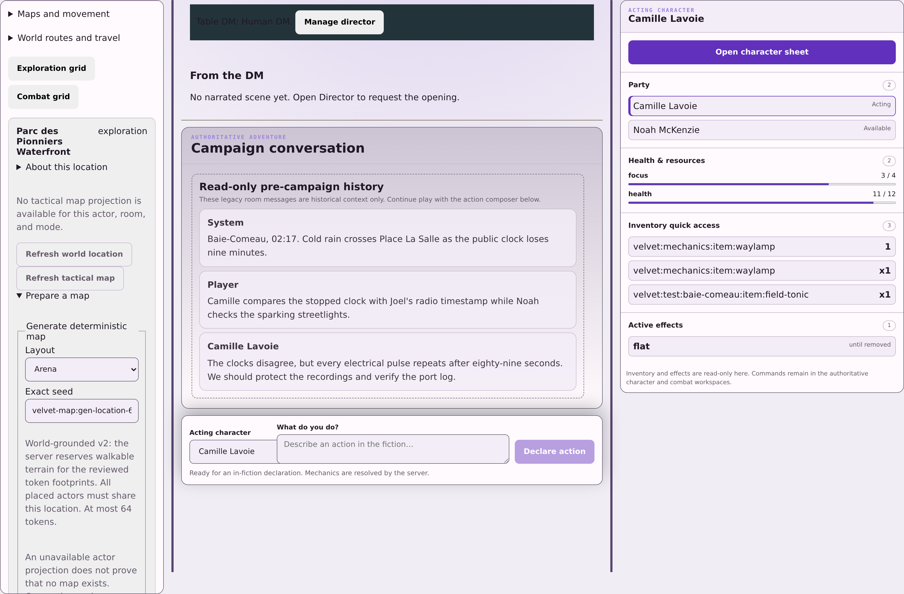
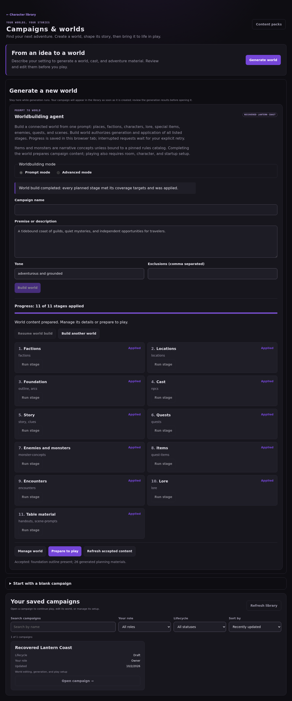
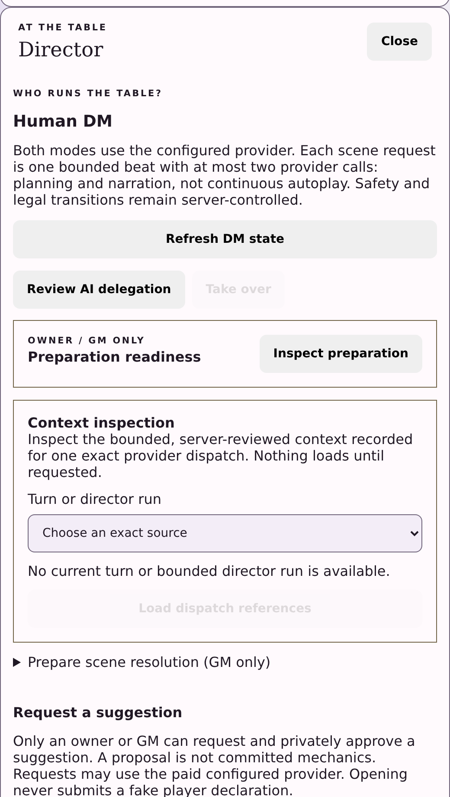
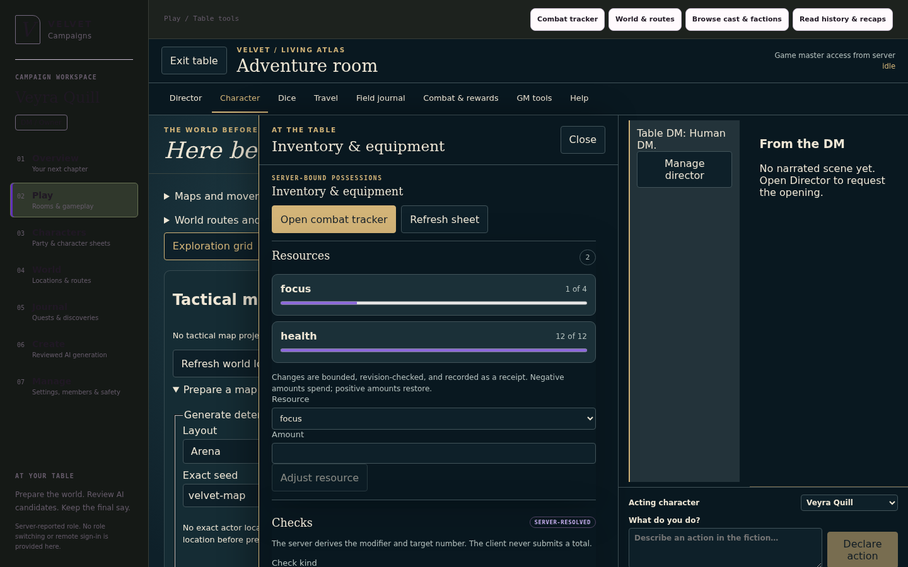
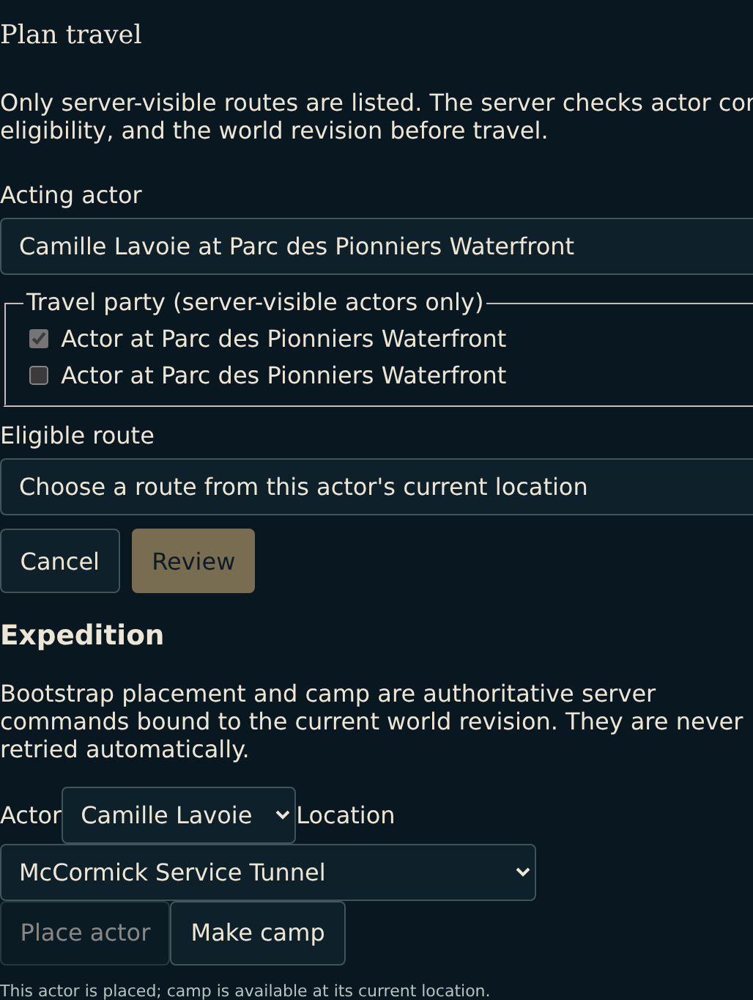
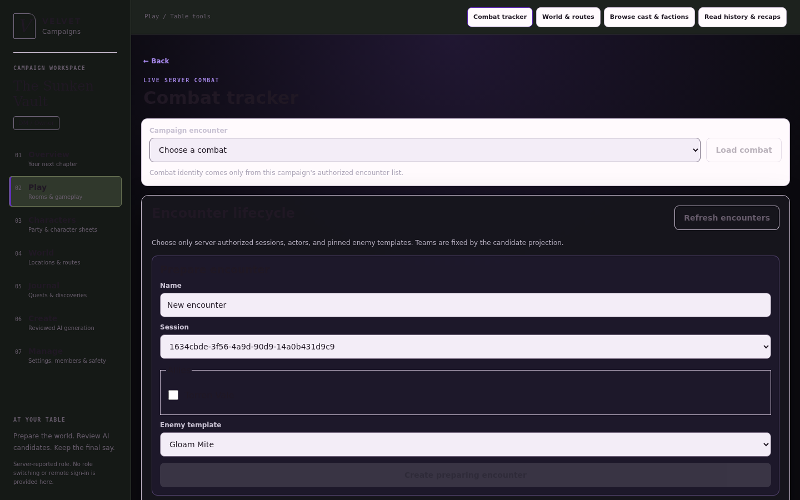
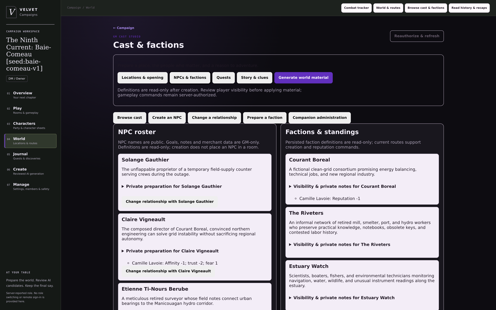

# VelvetRP

**Build a world. Bring its characters to life. Make your adventures matter.**

VelvetRP is a local-first AI roleplay and campaign RPG application. Start with a single premise, generate a connected world, shape its cast and mysteries, and play through a persistent adventure with an optional AI Dungeon Master. Free-form conversation, tactical play, character sheets, and campaign preparation share one workspace.

[Quick start](#quick-start) · [Your first adventure](#your-first-adventure) · [Features](#feature-tour) · [Screenshots](#screenshots) · [Documentation](#documentation)

> The model can propose what happens next. It cannot decide what became true.

Velvet pairs expressive AI narration with server-owned rules and durable records of what actually happened. Conversations can flow without a dice roll; travel, purchases, checks, and combat resolve through validated game commands.



*The Living Atlas keeps the conversation, world, and acting character together. Screenshots use fictional, provider-free test campaigns.*

## Why Velvet

### One premise, a connected world

Describe a setting and choose **Build world**. An 11-stage builder covers **all 14 content sections**: the opening, arcs, locations and routes, factions, NPCs, quests, encounter plans, clues, story graphs, lore, special-item concepts, monster concepts, handouts, and scene prompts.

Stages build on accepted material rather than guessing future references. Coverage checks require located NPCs, actionable quests, an opening tied to a real place, and traversable public routes. Progress is visible, interrupted work can be reconciled, and **Manage world** and **Prepare to play** take you directly to the next step. For finer control, use reviewed single-draft generation, granular expansion, or an advanced stage plan.

### Characters worth returning to

Create characters with goals, ideals, bonds, flaws, histories, relationships, appearance, voice, and boundaries. Start a solo conversation or a room with up to twelve characters, with attributed replies, streaming, reply swipes, and branching conversations.

Selected branches shape their summaries and memories. In campaign play, grounded social turns and routine observations can receive natural narration without unnecessary mechanical checks; the narrator receives an explicit local NPC roster and bounded, disclosable knowledge.

### A world with memory and consequences

Campaign recall draws from declarations, recorded outcomes, recaps, and prior exchanges while preserving their source and authority. NPC observations separately record who witnessed an event or heard about it, allowing attributed rumors and callbacks without treating everyone as omniscient.

Current state outranks historical prose. A remembered purchase does not put a sold item back in your inventory, and another character's claim does not become a verified event. GM context inspection makes the evidence behind a dispatch inspectable.

### An AI Director you can hand the reins to

Stay in human-DM mode, review exact AI proposals, or explicitly delegate supported scene direction. **Open scene** and **Continue scene** let the Director introduce prepared situations, compose short sequences of supported actions, advance recorded world time, and narrate present NPCs.

Take over when you want. Player decisions remain yours, private planning stays separate from public narration, and each committed action has its own receipt—a durable record of the result.

### A playable tabletop, alongside the story

The **Living Atlas** brings together campaign conversation, world routes, exploration and combat maps, character resources, inventory, journals, and GM tools. Desktop and mobile layouts keep the action composer accessible while drawers expose deeper controls.

Use server-resolved checks, spells and powers, equipment, rests, vendor commerce, bilateral trades, encounter tools, and rewards. Tactical movement uses an authoritative preview and confirmation; supported attacks account for position, cover, range, and reactions.

### Your data, your provider, inspectable rules

Campaigns live in local SQLite. Choose a compatible hosted or loopback OpenAI-compatible provider, tune the prompt harness, inspect usage, and bind campaigns to exact immutable content-pack versions.

The SRD 5.1 starter includes catalog material for twelve classes at levels 1–20, ancestries, spells, equipment, magic items, and monsters. Executable rules are tracked separately in the [coverage matrix](docs/srd-5.1-coverage.md), so catalog breadth is never confused with full rules support.

## Quick start

**Requirements:** Node.js **22**, npm, and a browser. AI narration and world generation need a compatible model provider. Playwright Chromium is needed only for browser tests.

### 1. Install

From the repository root:

```bash
npm ci
cp .env.example .env
```

### 2. Enable the campaign experience

Edit the corresponding entries in `.env`:

```dotenv
FEATURE_RPG_CAMPAIGN=true
FEATURE_RPG_MECHANICS=true
FEATURE_RPG_COMBAT=true
FEATURE_RPG_STUDIO=true
```

The example already supplies OpenRouter's base URL and a model. Add your `OPENROUTER_API_KEY`, or configure a compatible provider through the app's provider settings. Keep `HOST=127.0.0.1` and `FEATURE_REMOTE_AUTHENTICATION=false`.

### 3. Start Velvet

Velvet does **not** load `.env` automatically. In Bash or a compatible shell:

```bash
set -a
source .env
set +a
npm run dev
```

Open **[http://localhost:5173](http://localhost:5173)**.

| Service | Default address |
| --- | --- |
| Web app | `http://localhost:5173` |
| API | `http://127.0.0.1:8787` |
| Health check | `http://127.0.0.1:8787/api/health` |

The Vite development server proxies `/api` to `VELVET_API_URL`. For separate client/server processes, export the environment in each shell.

### Provider setup

- **Hosted or local:** use an OpenAI-compatible `/chat/completions` endpoint. Provider labels alone do not establish support for the tools and structured output used by RPG play and generation.
- **Capability check:** the explicit provider preflight checks DM-play and generation capabilities separately and may incur provider charges.
- **Saved settings win:** environment values bootstrap a new installation; normal settings saved in the app take precedence afterward.
- **OpenAI fallbacks:** to use `OPENAI_BASE_URL`, `OPENAI_MODEL`, or `OPENAI_API_KEY`, remove the corresponding `OPENROUTER_*` assignment. Even an empty OpenRouter value takes precedence.
- **Provider-free use:** a blank provider base URL selects the clearly marked local roleplay stub. Campaign administration, reviewed content, deterministic mechanics, and recovery remain available; generated worlds require a provider or explicitly supplied reviewed content.

See [Provider configuration](docs/provider-configuration.md) for endpoint restrictions, credentials, budgets, samplers, and troubleshooting.

## Your first adventure

1. **Generate a world.** Open **Campaigns & worlds → Generate world**, enter a name and premise, and choose a tone and exclusions. For example:

   > A tidebound coastal town where a lighthouse shines beneath the sea. Rival salvage guilds, missing ferrymen, and a winter festival offer several independent mysteries. Give the inhabitants competing aims and make exploration as useful as combat.

2. **Build and inspect.** Choose **Build world** to authorize the serial generation-and-apply plan. New worlds receive the SRD starter setup. Follow the stage progress, then use **Manage world** to inspect locations, cast, quests, and preparation. Public handouts and scene prompts have separate publication controls.
3. **Prepare the table.** Choose **Prepare to play**. Create or finalize a campaign character, complete rules and safety preparation, and create or attach a room. The readiness view identifies what is still needed; a prepared world is not yet a running session.
4. **Enter the adventure.** Activate a ready room and enter the Living Atlas. Use human-DM mode, review an AI suggestion, or explicitly delegate the Director and choose **Open scene**.
5. **Say what you do.** Write a free-form declaration, use the sheet or map to prefill one, and review confirmations when required. Reopen saved campaigns from the searchable library to continue.

For character-only roleplay, start from the **Character library**, create or select your cast, and open a solo or group conversation. A campaign is optional.

The [worldbuilding guide](docs/campaign-generation.md) explains stage minimums, review modes, and interrupted-build recovery. The [control-plane guide](docs/frontend-control-plane.md) covers room preparation, activation, and table controls.

## Feature tour

| Area | Available today |
| --- | --- |
| **Worldbuilding** | One-prompt staged worlds; Foundation, Full narrative campaign, and Custom / granular drafts; accepted-canon expansion; selective application; exact catalog bindings; explicit player-material publication. |
| **Library and preparation** | Search, role/lifecycle filters, recent/name sorting, blank campaigns, world/play handoffs, starter rules, safety review, opening designation, character and room readiness. |
| **Character roleplay** | Rich editable profiles, import/export, solo and group rooms, speaker routing, streaming, cancellation, alternate replies, branches, approved/pending memories, scoped lore, summaries, and editable scene canon. |
| **Campaign continuity** | Durable DM transcript, narration-only variants, source-attributed recall, location-aware NPC presence, witnessed/told/gossip observations, trust-gated disclosure, and private context inspection. |
| **Character mechanics** | Drafts, allocation choices, server rolls and full rerolls, finalization, derived sheets, XP/progression, inventory, equipment, resources, effects, rests, and supported magic-item attunement. |
| **Tactical play** | Exploration/combat grids, fog, movement previews, terrain, cover, range, supported opportunity and readied reactions, combat logs, encounter building, reviewed encounter generation, and reward workflows. |
| **World and social systems** | Directed travel, actor placement and camp, NPC placement, factions and reputation, quests and objectives, clues/story graphs, present-vendor commerce, bilateral trade, and companion creation/grant administration. |
| **Campaign management** | Lifecycle and settings, room attachment/detachment, membership records, timelines, checkpoints, recaps, history, import/export, and immutable content-pack publication/pinning. |
| **AI controls** | Optional human/AI Director, proposal review and takeover, bounded tool execution, prompt studio, provider settings, token usage, cost estimates, and deterministic recovery. |
| **Optional presentation** | Self-hosted scene illustrations and OmniVoice narration with persistent narrator/NPC casting, captions, and explicit playback controls. Both require separate configuration. |

### Optional integrations

- **[Scene illustrations](docs/scene-image-integration.md):** server-mediated Supra2 scene-image generation, GM review/selection, and player display. Images are presentation and cannot change the game.
- **[Narrator and NPC voices](docs/omnivoice-support-plan.md):** opt-in OmniVoice playback of completed public narration, with stable casting and captions. Speech does not execute or repeat game commands.
- **[System One / Jev](docs/jev-integration.md):** optional typed-decision evaluation and confidence-gated routing. Active behavior requires an exact passing evaluation binding; shadow room-routing and record-only advisory calls run alongside the primary path.
- **[Hydration CLI](docs/hydration-cli.md):** execute reviewed content recipes with durable ledgers, additive fill work, and explicit recovery.

Optional features default off. `FEATURE_VOICE` and `FEATURE_IMAGES` report availability; the actual services also require their documented opt-ins and configuration. Feature flags are rollout controls, not authorization. All environment settings are listed in [Operations](docs/operations.md#environment).

## Screenshots

These are real application captures using fictional test data. The worldbuilder capture shows the completed deterministic 11-stage recovery flow; the remaining views use the provider-free Baie-Comeau fixture.

<details>
<summary><strong>Worldbuilding — from one premise to all eleven applied stages</strong></summary>



</details>

<details>
<summary><strong>Director — scene control, delegation, and private review</strong></summary>



</details>

<details>
<summary><strong>Character sheet — checks, powers, resources, and equipment</strong></summary>



</details>

<details>
<summary><strong>World and combat — expedition setup and encounter management</strong></summary>





</details>

<details>
<summary><strong>Cast and factions — people, relationships, and private preparation</strong></summary>



</details>

## How it works

```text
React + Vite client
        │ HTTP / server-sent events
        ▼
Fastify API ── bounded context and tool requests ──► Model provider
        │             ◄── validated proposals and narration
        ▼
Repository + deterministic rules
        │ atomic commands, revisions, events, receipts
        ▼
Local SQLite
```

Shared **TypeScript and Zod contracts** connect the client, API, and persistence boundaries. The server derives legal actions and exact candidates, validates provider selections, obtains required confirmation, and commits commands atomically. Narration can describe mechanical changes only when receipts establish them. Routine conversation can remain receipt-free.

Interrupted durable operations reconcile against saved state instead of blindly replaying writes. Regenerating campaign narration reuses the original mechanics. Generated canon and published content-pack versions are immutable; expansion is additive.

| Directory | Responsibility |
| --- | --- |
| `client/` | React application, campaign workspaces, HTTP/SSE clients |
| `server/` | Fastify routes, roleplay/Director orchestration, repositories, rules, SQLite |
| `packages/contracts/` | Shared runtime schemas and inferred types |
| `scripts/` | Hydration, evaluation, catalog publication, and maintenance tools |
| `e2e/` | Deterministic and opt-in live browser workflows |
| `docs/` | Product guides, API, operations, architecture, research, and roadmap |

The [API reference](docs/api.md) owns the full contract: **177 counted** explicit trusted-local RPG operations plus feature discovery, excluding implicit HEAD aliases.

## Data and privacy

The default database is `server/data/velvet.sqlite` when launched through the server workspace. Set an absolute `VELVET_DATA_DIR` to choose another location. SQLite uses WAL mode, foreign keys, and transactional writes.

**Local-first means local storage, not necessarily local inference.** Configured remote providers receive assembled prompts and conversation context. Provider keys are stored locally, redacted from public settings reads, and sent only to permitted destinations; database backups can contain those keys. See [credential handling](docs/provider-configuration.md#credentials-and-backups).

The current server is a **trusted-local application**: it binds to loopback and uses fixed `local-owner` authority. It has no remote authentication boundary, and enabling `FEATURE_REMOTE_AUTHENTICATION` does not add one. Run it locally rather than exposing it as an untrusted multi-user service.

Development databases are disposable: schema changes require deleting and recreating `velvet.sqlite`, except for the narrowly recognized exact-predecessor upgrades documented in [Operations](docs/operations.md#data-directory-and-current-schema). Unknown or partially upgraded schemas reject without repair. Check that guide before changing stored data. Campaign exports omit credentials, local paths, usage history, and private actor state; they are not full database backups.

## Current boundaries

Velvet is an actively developed MVP with real playable systems and explicit limits:

- **Preparation still matters.** A completed generated world needs a character, an attached room, and activation/startup preparation. Item and monster concepts bind to exact catalog definitions or stay inert; accepting them does not grant inventory or spawn combat.
- **Free-form intent exceeds the current tool set.** The adventure agent executes only advertised actions. NPC attack/combat initiation and short-rest declarations remain observed gaps in live evaluation even though explicit encounter/rest controls exist.
- **SRD execution is partial.** Catalog coverage does not imply every spell, class feature, or rules interaction is implemented. Multiclass progression and other exclusions are recorded in the coverage inventory.
- **Memory and recovery are bounded.** Recall is source-filtered and size-limited, not an omniscient semantic memory. Worldbuilding journals survive same-tab reloads, not cross-device recovery. Legacy chat recovery uses transcript snapshots rather than a durable operation-status endpoint.
- **Some product scope remains open.** Delegated companion grant exercise/dismissal, Discord/VTT adapters, and simultaneous encounters remain follow-up work. The current policy layer is limited and is not a comprehensive moderation system.

The [roadmap](docs/ROADMAP.md) tracks remaining scope. The [2026-10-02 implementation audit](docs/roleplay-worldbuilding-audit-2026-10-02.md) records a live 125-artifact world build, an 18-turn before/after play comparison, focused follow-up probes, and the exact validation limits.

## Development and validation

| Command | Purpose |
| --- | --- |
| `npm run dev` | Build contracts; run watched server and client |
| `npm run dev:server` / `npm run dev:client` | Run one development service |
| `npm run typecheck` | Check contracts, server, client, E2E, and scripts |
| `npm run build` | Build contracts, server, and client |
| `npm test` | Contract, server, and client tests |
| `npm run test:server:quick` | Broader server sweep excluding the heaviest acceptance files |
| `npm run test:server:serial -- test/repo.test.ts` | Run selected server tests without file parallelism |
| `npm run test:e2e -- --workers=1` | Deterministic browser flows, one worker |
| `npm run health` | Release gate: typecheck → build → unit tests → deterministic E2E |
| `npm run ci` | Clean install, typecheck, build, and unit tests |

For focused changes, run the affected test file(s) and owning workspace typecheck. Run heavy suites and browser passes sequentially rather than launching overlapping validation jobs. CI remains the full gate; use `npm run health` at release boundaries with the [documented prerequisites and temporary-directory setup](docs/operations.md#release-health-gate).

Install the test browser once:

```bash
npx playwright install chromium
```

Deterministic E2E uses disposable SQLite and a fake provider, including real generation validation/application, play, streaming, persistence, and recovery. It makes no paid provider calls. Live-provider E2E is separately opt-in and may incur cost:

```bash
VELVET_E2E_LIVE=1 npm run test:e2e:live -- --workers=1
```

After `npm run build`, `npm --workspace velvet-mvp-server start` runs the compiled API server. The client build is in `client/dist`; see [Operations](docs/operations.md) for environment and deployment guidance.

Contributions should preserve strict contracts, authoritative mechanics, and exact recovery. Start with [CONTRIBUTING.md](CONTRIBUTING.md) and the [engineering handoff](handoff.md).

## Documentation

| Start here | What it covers |
| --- | --- |
| [Documentation index](docs/README.md) | Complete guide inventory and authority hierarchy |
| [Campaign generation](docs/campaign-generation.md) | Prompt-to-world workflow, staged plans, review, coverage, and recovery |
| [Campaign control plane](docs/frontend-control-plane.md) | Preparation, room activation, Living Atlas, and session recovery |
| [AI Dungeon Master](docs/ai-dungeon-master.md) | Director controls, proposals, narration, and scene progression |
| [Campaign memory](docs/campaign-memory.md) | Recall sources, NPC knowledge, branch continuity, and bounds |
| [SRD 5.1 coverage](docs/srd-5.1-coverage.md) | Rules, catalog, runtime evidence, and unsupported mechanics |
| [Provider configuration](docs/provider-configuration.md) | Hosted/local models, capability checks, budgets, and credentials |
| [Operations](docs/operations.md) | Environment, local deployment, storage, testing, and troubleshooting |
| [API reference](docs/api.md) · [Streaming](docs/streaming.md) | HTTP contracts, SSE families, and reconciliation |
| [DM harness](docs/dm-harness-architecture.md) · [Repository architecture](docs/repo-architecture.md) | Context, tools, authority, persistence, and module ownership |
| [Live evaluation and audit](docs/roleplay-worldbuilding-audit-2026-10-02.md) | Implementation evidence, measurements, and known limits |
| [Roadmap](docs/ROADMAP.md) · [Development ledger](devplan.md) | Delivered work and remaining scope |

## SRD attribution

The `dnd-5e@1.0.0` development ruleset adapts material from Wizards of the Coast LLC's **System Reference Document 5.1 (2014 Fifth Edition)**. The current starter publication is `srd-5.1:starter@1.6.0+c1b2d4fd32d6`; exact campaign pins preserve earlier publications.

The [official SRD source page](https://www.dndbeyond.com/srd) provides the [SRD 5.1 Creative Commons PDF](https://media.dndbeyond.com/compendium-images/srd/5.1/SRD_CC_v5.1.pdf), licensed under [CC BY 4.0](https://creativecommons.org/licenses/by/4.0/legalcode). Velvet adapts and modifies this material into bounded software mechanics; Wizards of the Coast LLC has not endorsed those modifications. See [NOTICE.md](NOTICE.md) for attribution and [the coverage inventory](docs/srd-5.1-coverage.md) for the implementation boundary.
